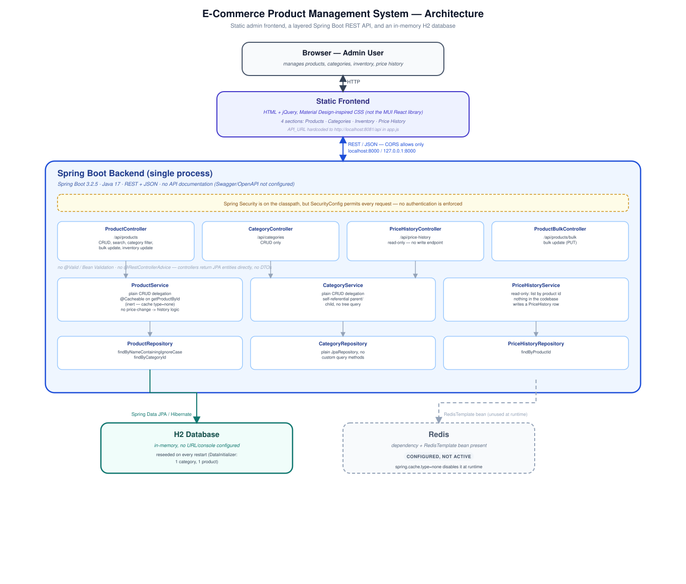

# E-Commerce Product Management System

A full-stack product administration system for maintaining catalog data — products, hierarchical categories, inventory levels, and price-change records — through a Spring Boot REST API and a static browser-based admin interface. This is a product-management/admin tool, not a customer-facing storefront: there is no cart, checkout, or order flow.

## Engineering Highlights

- **Layered backend, applied consistently.** Every resource (products, categories, price history) follows Controller → Service → Repository → Spring Data JPA, with no business logic embedded in controllers.
- **A hierarchical category model.** `Category` has a self-referential `parent`/`children` relationship (`@ManyToOne`/`@OneToMany` on the same entity), so categories form a tree rather than being flat strings or an enum — though no endpoint currently exercises the tree structure (see [Features](#catalog--categories)).
- **Backend-driven search and filtering.** Product search (`findByNameContainingIgnoreCase`) and category filtering (`findByCategoryId`) are Spring Data derived-query methods executed by the database, not client-side array filtering — the frontend calls these on every keystroke.
- **A separate schema for price history, with a real gap worth stating plainly.** `PriceHistory` is modeled as its own entity, linked one-to-many from `Product`, with a read endpoint to query it — but no code path in this repository currently creates a `PriceHistory` record when a product's price changes. See [Price History](#price-history) for exactly what exists versus what doesn't.
- **Caching infrastructure is wired, not just present in `pom.xml`.** `@EnableCaching`, a `RedisTemplate` bean, and an actual `@Cacheable` annotation on `ProductService.getProductById` all exist — and are deliberately neutralized via `spring.cache.type=none` in `application.properties` rather than left in a half-configured state. See [Engineering Decisions](#engineering-decisions).
- **CORS is explicitly scoped, not left open.** `WebConfig` restricts `/api/**` to specific origins rather than using a wildcard — though see [Getting Started](#getting-started) for a real mismatch between that configuration and the frontend's suggested serving port.

## Domain Model

```text
Category
  |
  +-- parent   (self-reference, optional)
  +-- children (self-reference, list)
       |
       v
    Product ──(one-to-many, cascade ALL)──> PriceHistory
       |
       +-- stock: plain int field (no history — see Inventory)
```

Three JPA entities: `Product` (name, description, price, imageUrl, stock, category, timestamps — no SKU or brand field), `Category` (name, self-referential parent/children), and `PriceHistory` (product, oldPrice, newPrice, changedAt). There is no `InventoryHistory` entity, despite that being implied by the original project description — stock is a single mutable integer on `Product`, with no record of previous values.

## Features

### Product Management

Full CRUD through `/api/products`: create, list, fetch by ID (404 if missing), update, delete. No Bean Validation exists anywhere in the request path — there's no `spring-boot-starter-validation` dependency, no `@Valid`, `@NotNull`, or `@Positive` on the `Product` entity or in the controller, and no service-level checks either. A request with a negative price or a blank name is accepted as-is; the only "validation" is the frontend's HTML5 `required` attributes, which a direct API call bypasses entirely. `DELETE` calls `deleteById` directly without checking existence first, so deleting a non-existent ID throws an unhandled `EmptyResultDataAccessException` (a raw 500) rather than a clean 404.

### Catalog / Categories

`Category` is a real entity with its own table and a self-referential parent/child relationship, giving the data model room for a category tree. In practice, the API only exposes flat CRUD (`/api/categories`) — there's no endpoint to fetch a category's children or walk the tree, and nothing prevents a duplicate name or a parent reference that creates a cycle.

### Inventory

Stock is updated through a dedicated endpoint, `PUT /api/products/{id}/inventory?stock=N`, separate from the general product update. It includes one real business rule: a hardcoded low-stock threshold (`stock < 5`), which logs a message to the server console. This is a placeholder, not a notification system — the code comment on that line literally says "In a real system, trigger notification/email here." There is no history of past stock levels, and no validation preventing a negative value.

### Price History

`PriceHistory` (product, old price, new price, timestamp) is a genuine entity with its own table and a one-to-many relationship from `Product`, exposed read-only at `GET /api/price-history/product/{id}`. What's actually missing is the write path: `ProductService.saveProduct()` — used by both create and update — is a direct pass-through to `productRepository.save(product)`, with no comparison of the old and new price and no creation of a `PriceHistory` row. There is no `POST` endpoint on `PriceHistoryController` either. As shipped, updating a product's price silently overwrites it, and querying that product's price history returns an empty list. The schema and read API are in place for this feature; the logic that would populate them is not yet written.

### Search & Filtering

`GET /api/products/search?name=X` performs a case-insensitive, partial, single-field match against the product name via a Spring Data derived query — real backend search, not a client-side filter. `GET /api/products/category/{categoryId}` filters by category the same way. There is no price-range filter, no stock/availability filter, and no way to combine multiple criteria in one request.

## Architecture



A static HTML/jQuery frontend calls a single Spring Boot process over REST/JSON; the backend talks to an in-memory H2 database through Spring Data JPA. Controllers hold no business logic and return JPA entities directly — there is no DTO layer separating the API shape from the persistence model. Spring Security is on the classpath but configured to permit every request (see [Security / Deployment Notes](#security--deployment-notes)). Redis/caching infrastructure exists in code but is disabled by configuration (see [Engineering Decisions](#engineering-decisions)).

## Engineering Decisions

**Why `Category` is self-referential instead of a flat string or enum.** A `parent`/`children` relationship on the same entity lets the data model represent an arbitrary category tree without a separate join table, even though the current API doesn't yet expose tree traversal.

**Why H2, in-memory.** No datasource URL is configured, so Spring Boot falls back to its default embedded H2 instance — zero setup for local development, at the cost of all data resetting on every restart. `DataInitializer` reseeds one category ("Electronics") and one product ("Smartphone") via a `CommandLineRunner` on every boot, which is what makes that trade-off workable for demos.

**Why Spring Security is a dependency but does nothing.** Adding `spring-boot-starter-security` without any configuration would make Spring Boot auto-generate a login form and a random password for every request. `SecurityConfig` exists specifically to disable that default and `permitAll()` instead — it is not an authentication layer, it is the absence of one, made explicit.

**Why Redis is configured but inactive.** `RedisConfig` defines a real `RedisTemplate` bean and enables Spring's caching abstraction, and `ProductService.getProductById` carries a real `@Cacheable` annotation. `application.properties` then sets `spring.cache.type=none`, which makes Spring substitute a no-op cache manager — the annotation is evaluated but caches nothing. This is caching infrastructure staged for later use, explicitly turned off rather than left connecting to a Redis instance that may not be running.

## Testing Strategy

One test class exists: `ProductServiceTest`, with one test method, `testSaveProduct`. It mocks `ProductRepository` with Mockito and asserts that `ProductService.saveProduct()` returns what the repository was stubbed to return. There is no test for `CategoryService`, `PriceHistoryService`, any controller, the derived repository queries, the search or category-filter endpoints, or the inventory endpoint. No coverage tool is configured in `pom.xml`, and there is no CI configuration in the repository (no `.github/workflows`, no other CI file) — this test runs only when invoked locally.

## API Overview

No Swagger/OpenAPI is configured (no `springdoc` dependency) — this table is the API documentation.

| Method | Endpoint | Purpose |
|---|---|---|
| GET | `/api/products` | List all products |
| GET | `/api/products/{id}` | Get one product (404 if missing) |
| POST | `/api/products` | Create a product |
| PUT | `/api/products/{id}` | Update a product |
| DELETE | `/api/products/{id}` | Delete a product |
| GET | `/api/products/search?name=` | Case-insensitive partial name search |
| GET | `/api/products/category/{categoryId}` | Products in a category |
| PUT | `/api/products/{id}/inventory?stock=` | Update stock, logs a low-stock console message under 5 |
| PUT | `/api/products/bulk` | Bulk update a list of products |
| GET | `/api/categories` | List all categories |
| GET | `/api/categories/{id}` | Get one category |
| POST | `/api/categories` | Create a category |
| PUT | `/api/categories/{id}` | Update a category |
| DELETE | `/api/categories/{id}` | Delete a category |
| GET | `/api/price-history/product/{productId}` | List price-history records for a product (currently always empty — see [Price History](#price-history)) |

## Tech Stack

| Area | Technology |
|---|---|
| Backend | Java 17, Spring Boot 3.2.5 (Web, Data JPA, Security) |
| Persistence | H2 (in-memory, default configuration) |
| Frontend | HTML, jQuery 3.6, hand-written CSS (Material Design-inspired: Roboto font, Material Icons, blue color scheme — not the MUI React component library) |
| Testing | JUnit 5, Mockito, AssertJ |
| Build | Maven |
| Present but inactive | Spring Data Redis, Spring Cache (`spring.cache.type=none`) |

## Project Structure

```text
E-Commerce_Product_Management_System/
├── pom.xml
├── src/
│   ├── main/
│   │   ├── java/com/ecommerce/product/
│   │   │   ├── ProductManagementSystemApplication.java
│   │   │   ├── DataInitializer.java        # seeds 1 category + 1 product on every startup
│   │   │   ├── config/
│   │   │   │   ├── SecurityConfig.java     # permitAll — no authentication
│   │   │   │   ├── WebConfig.java          # CORS for /api/**
│   │   │   │   └── RedisConfig.java        # RedisTemplate bean, @EnableCaching
│   │   │   ├── controller/                 # Product, Category, PriceHistory, ProductBulk
│   │   │   ├── service/                    # Product, Category, PriceHistory
│   │   │   ├── repository/                 # Spring Data JpaRepository interfaces
│   │   │   └── model/                      # Product, Category, PriceHistory entities
│   │   └── resources/application.properties
│   └── test/java/com/ecommerce/product/ProductServiceTest.java
├── frontend/
│   ├── index.html
│   ├── app.js
│   └── style.css
└── docs/architecture.svg
```

## Getting Started

### Prerequisites

Java 17+, Maven.

### Backend

```bash
mvn spring-boot:run
```

Starts on `http://localhost:8081`.

### Frontend

```bash
cd frontend
python3 -m http.server 8000
```

Then open `http://localhost:8000`. **Serve on port 8000, not 3000** — `WebConfig`'s CORS policy only allows `http://localhost:8000` and `http://127.0.0.1:8000`; a frontend served on another port will have its API requests blocked by the browser.

### Database

No `spring.datasource.url` is set, so Spring Boot starts a default embedded H2 instance with no console enabled — there's no built-in way to inspect the data directly. Data resets on every restart; `DataInitializer` reseeds one category and one product each time.

### Optional: Redis

Not required to run the application. `spring.cache.type=none` and `spring.redis.host=disabled` in `application.properties` keep the Redis dependency from attempting a connection. Enabling it would mean running a Redis instance and removing those two lines.

## Security / Deployment Notes

There is no authentication or authorization. `SecurityConfig` permits every request, and every endpoint under `/api/**` is reachable by anyone who can reach the server. CORS is restricted to a single local development origin. The database is in-memory and resets on restart. This is a local/portfolio-scope application, not a deployment-ready one — treat it accordingly rather than exposing it on a public network.

## Future Improvements

- Have `ProductService` compare old and new price on update and write a `PriceHistory` record in the same transaction, so the existing schema and read API actually get populated.
- Add Bean Validation (`spring-boot-starter-validation`, `@Valid`, `@NotBlank`, `@Positive`) and a `@RestControllerAdvice` for consistent error responses instead of raw exceptions and unchecked input.
- Introduce DTOs so controllers stop returning JPA entities directly.
- Use the existing Spring Security dependency for actual authentication rather than `permitAll()`.
- Add an `InventoryHistory` entity, mirroring `PriceHistory`, if stock-change auditing is desired.

## License

No `LICENSE` file is currently committed to this repository.
